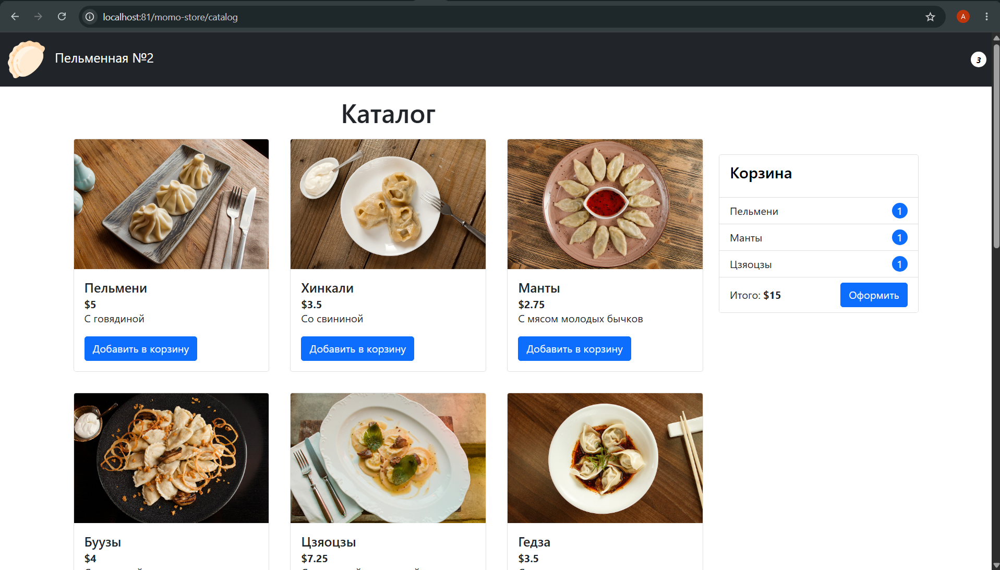

# Проект по дисциплине "Docker-контейнеризация"
---

## Базовые образы

---
Проект состоит из трех образов (контейнеров):
1) [backend](backend/Dockerfile)
   - Go сервер;
   - порт 8081;
   - healthcheck - проверка эндпоинта /health;
   - постоянный перезапуск до отмены пользователем;
   - [.dockerignore](backend/.dockerignore).
2) [frontend](frontend/Dockerfile)
   - статичные файлы;
   - завершение без перезапуска;
   - [.dockerignore](frontend/.dockerignore).
3) [nginx](nginx/Dockerfile)
   - nginx сервер;
   - отдача статики frontend;
   - проксирование запросов в backend;
   - порт 80;
   - зависит от frontend и backend;
   - healthcheck состояния;
   - постоянный перезапуск до отмены пользователем.
  
---

## Безопасность базовых образов

---
Все базовые образы проверены в workflow GitHub Actions через aquasecurity/trivy-action.

> Сканирование показало наличие уязвимости CVE-2026-45447 в используемой версии alpine (наиболее свежая на момент написания проекта)

> Поэтому во всех образах был принудительно установлен пакет openssl с исправлением (`apk add --no-cache openssl=3.5.7-r0`).

Дополнительно для безопасности в образах были использованы обычные пользователи (без root прав).

---

## Оптимизация размера базовых образов

---
В проекте были использованы различные технологии для оптимизации размера Docker-образов, в том числе следующие:
   - сборка из нескольких стадий;
   - использование небольших образов с базовым минимумом (на основе alpine);
   - оптимизации компиляции бинарного файла Go;
   - очищение кэша сразу после выполнения команд или их выполнение без кэша.

### Образ backend
| #  | Слой                                               | Размер  |
| -- | -------------------------------------------------- | ------- |
| 1  | `ADD alpine-minirootfs-3.24.0-x86_64.tar.gz /`     | 3.69 MB |
| 2  | `CMD ["/bin/sh"]`                                  | 0 B     |
| 3  | `RUN apk add ...`                                  | 2.69 MB |
| 4  | `WORKDIR /app`                                     | 91 B    |
| 5  | `RUN addgroup -S ...`                              | 949 B   |
| 6  | `COPY --chown=app_user:app_user /app/server-app .` | 4.20 MB |
| 7  | `USER app_user`                                    | 0 B     |
| 8  | `EXPOSE 8081/tcp`                                  | 0 B     |
| 9  | `HEALTHCHECK ...`                                  | 0 B     |
| 10 | `CMD ["./server-app"]`                             | 0 B     |

Итоговый размер 10.58 MB

### Образ frontend
| # | Слой                                           | Размер    |
| - | ---------------------------------------------- | --------- |
| 1 | `ADD alpine-minirootfs-3.24.0-x86_64.tar.gz /` | 3.69 MB   |
| 2 | `CMD ["/bin/sh"]`                              | 0 B       |
| 3 | `RUN apk add ...`                              | 2.69 MB   |
| 4 | `WORKDIR /app`                                 | 91 B      |
| 5 | `COPY /app/dist /app/static`                   | 488.53 KB |

Итоговый размер 6.87 MB

### Образ nginx
| #  | Layer                                                       | Size    |
| -- | ----------------------------------------------------------- | ------- |
| 1  | `ADD alpine-minirootfs-3.23.4-x86_64.tar.gz /`              | 3.69 MB |
| 2  | `CMD ["/bin/sh"]`                                           | 0 B     |
| 3  | `LABEL maintainer=NGINX Docker Maintainers`                 | 0 B     |
| 4  | `ENV NGINX_VERSION=1.31.1`                                  | 0 B     |
| 5  | `ENV PKG_RELEASE=1`                                         | 0 B     |
| 6  | `ENV DYNPKG_RELEASE=1`                                      | 0 B     |
| 7  | `RUN set -x ...`                                            | 1.80 MB |
| 8  | `COPY docker-entrypoint.sh /`                               | 628 B   |
| 9  | `COPY 10-listen-on-ipv6-by-default.sh /docker-entrypoint.d` | 957 B   |
| 10 | `COPY 15-local-resolvers.envsh /docker-entrypoint.d`        | 405 B   |
| 11 | `COPY 20-envsubst-on-templates.sh /docker-entrypoint.d`     | 1.18 KB |
| 12 | `COPY 30-tune-worker-processes.sh /docker-entrypoint.d`     | 1.37 KB |
| 13 | `ENTRYPOINT ["/docker-entrypoint.sh"]`                      | 0 B     |
| 14 | `EXPOSE 80/tcp`                                             | 0 B     |
| 15 | `STOPSIGNAL SIGQUIT`                                        | 0 B     |
| 16 | `CMD ["nginx","-g","daemon off;"]`                          | 0 B     |
| 17 | `RUN apk add ...`                                           | 2.71 MB |
| 18 | `RUN addgroup -S ...`                                       | 978 B   |
| 19 | `COPY nginx.conf /etc/nginx/conf.d/default.conf`            | 444 B   |
| 20 | `RUN chown -R ...`                                          | 628 B   |
| 21 | `USER nginx_user`                                           | 0 B     |
| 22 | `EXPOSE 80/tcp`                                             | 0 B     |
| 23 | `HEALTHCHECK ...`                                           | 0 B     |

Итоговый размер 8.2 MB

### Сводная таблица
| Образ     |        Размер |
| --------- | ------------: |
| Backend   |     ~10.58 MB |
| Frontend  |      ~6.87 MB |
| Nginx     |      ~8.20 MB |
| **Всего** | **~25.65 MB** |

---

## Деплой

---

Структура docker compose:
   - 3 сервиса: backend, frontend и nginx;
   - 2 сети: frontend и backend;
   - 1 volume - для статики с frontend.

Дополнительная безопасность:
   - использование capabilities;
   - лимиты памяти и CPU;
   - временная файловая система.

Сценарии использования:
1) Локальная сборка (например, для разработки)
   - [docker-compose.yml](docker-compose.yml);
   - [пример файла переменных окружения](.env.example.dev);
   - сборка docker-образов с нуля;
   - открыта возможность подключения к backend-контейнеру;
   - Пример запуска: `docker compose -f docker-compose.yml up --build`.
2) Production использование
   - [docker-compose.prod.yml](docker-compose.prod.yml);
   - [пример файла переменных окружения](.env.example.prod);
   - использование готовых образов из dockerhub;
   - Пример запуска: `docker compose -f docker-compose.prod.yml up --build`.

Переменные окружения и секреты
Для гибкости конфигурации контейнеров введены следующие переменные:
   - `BACKEND_VERSION`  - Версия backend приложения;
   - `FRONTEND_VERSION` - Версия frontend приложения;
   - `GO_VERSION`       - Версия go;
   - `NODE_VERSION`     - Версия node;
   - `TZ`               - Часовой пояс;
   - `NGINX_PORT`       - Внешний порт для доступа к приложению.

Для конфигурирования сервисов используются переменные окружения, описанные в следующих файлах:
- [.env.example.dev](./.env.example.dev);
- [.env.example.prod](./.env.example.dev).

В проекте используются секреты GitHub Actions, .env файлы.
Чувствительной информации в образах нет. 

> [!NOTE]
> Чтобы избежать усложнения структуры и сохранить прозрачность, был введен минимум переменных.
> При необходимости во время развития проекта можно добавлять переменные, например, для backend-приложения.

Горизонтальное масштабирование
  - Несколько реплик сервиса backend поднимаются флагом --scale;
  - Контейнер nginx проксирует запросы к /api на имя сервиса backend в Docker-сети; 
  - Встроенный DNS при нескольких репликах отдаёт несколько адресов, а в frontend/nginx/default.conf включены resolver 127.0.0.11 и proxy_pass через переменную, чтобы nginx периодически заново резолвил имя и распределял нагрузку между инстансами.

Пример запуска с 3 репликами backend:
```bash
docker compose -f docker-compose.prod.yml up --build --scale backend=3
```
В результате
```bash
NAME                                                    IMAGE                                 COMMAND                  SERVICE   CREATED          STATUS                    PORTS
cloud-services-engineer-docker-project-sem2-backend-1   inkve/docker-project-backend:latest   "./server-app"           backend   14 minutes ago   Up 17 seconds (healthy)   8081/tcp
cloud-services-engineer-docker-project-sem2-backend-2   inkve/docker-project-backend:latest   "./server-app"           backend   14 minutes ago   Up 16 seconds (healthy)   8081/tcp
cloud-services-engineer-docker-project-sem2-backend-3   inkve/docker-project-backend:latest   "./server-app"           backend   14 minutes ago   Up 14 seconds (healthy)   8081/tcp
cloud-services-engineer-docker-project-sem2-nginx-1     inkve/docker-project-nginx:latest     "/docker-entrypoint.…"   nginx     14 minutes ago   Up 8 seconds (healthy)    0.0.0.0:80->80/tcp, [::]:80->80/tcp
```

---

## Результаты

---

По результатам запуска командой `docker compose -f docker-compose.prod.yml up --build --scale backend=3` (использование production docker-compose файла и 3-х реплик backend-сервиса) и измененным `NGINX_PORT=81` в .env файле наблюдаем корректную работу приложения


